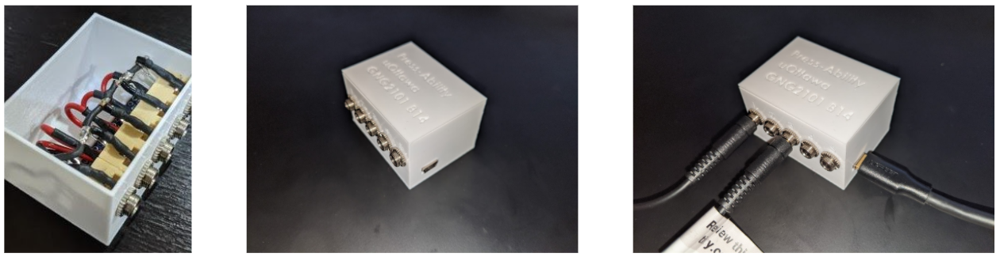

# GNG2101 Accessible Switches

This project was created for an Ottawa based non for profit that helps adults with disabilities learn computer skills while taking GNG2101: Introduction to Product Development and Management at the University of Ottawa. The project is combination of software and hardware that allows accesible switches to connect to an arduino
and send input to software that controls the mouse. Accessible switches are buttons used by people with impaired hand/arm movement from diseases such as cerebral paulsy, multiple sclerosis, and parkinsons to access a computer.

## Hardware

The hardware for this project was designed by [Ethan Bowering](https://github.com/ethanbowering24). It consists of an Arduino Nano, five 3.5mm jacks (that connect to accessible switches), and a 3D printed PLA housing.

## Software

The software for this project was written in Go and receives serial input from the arduino representing button presses. This is used to perform one of two methods of controling the mouse. The first method scrolls the mouse across the screen and stops when a button is pressed. The second method requires the user to choose left or right cutting the screen in half each time. This is repeated for selecting a position on the vertical axis. These methods can be configured using a simple [form](config.html) created with HTML.
